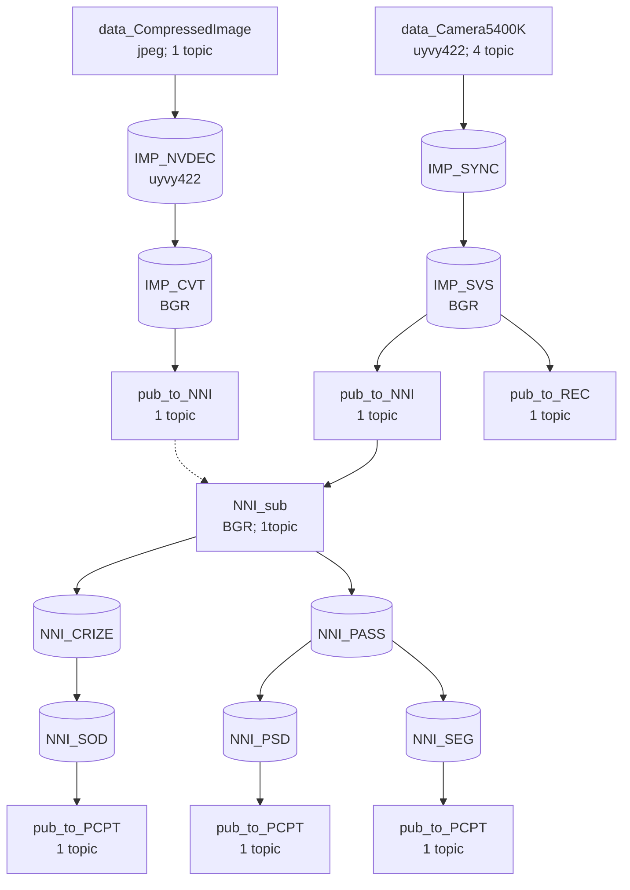

```mermaid
graph TB;
data1[data_CompressedImage\njpeg; 1 topic]-->decode[(IMP_NVDEC\nuyvy422)] 

decode-->ToBGR[(IMP_CVT\nBGR)]  

ToBGR-->pub1[pub_to_NNI\n1 topic] 


data2[data_Camera5400K\nuyvy422; 4 topic]-->SYNC[(IMP_SYNC)]  

SYNC-->CAT[(IMP_SVS\nBGR)]  

CAT-->pub2[pub_to_NNI\n1 topic] 

CAT-->pub2-0[pub_to_REC\n1 topic] 


pub1-.-> |" "|data3
pub2-->data3

data3[NNI_sub\nBGR; 1topic] --> Prep[(NNI_CRIZE)]

data3[NNI_sub\nBGR; 1topic] --> SV[(NNI_PASS)]

Prep-->SOD[(NNI_SOD)] -->pub3-1[pub_to_PCPT\n1 topic] 
SV-->PSD[(NNI_PSD)]-->pub3-2[pub_to_PCPT\n1 topic] 
SV-->SEG[(NNI_SEG)]-->pub3-3[pub_to_PCPT\n1 topic] 


```

