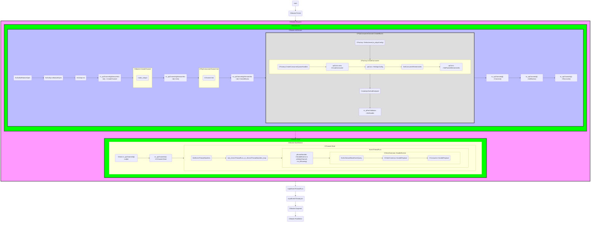

```mermaid
flowchart TB

A("main") --> B("CMaster.PreInit")
    --> CMaster.Resume["CMaster.Resume"]
    --> D("InputEventThreadFunc") 
    --> E("inputEventThread.join")
    --> F("CMaster.Suspend")
    --> G("CMaster.PostDeInit")

subgraph CMaster.Resume
    direction TB
    style CMaster.Resume fill:#f9f,stroke:#333,stroke-width:4px

      CMaster.Init("CMaster.Init") --> CMaster.Start("CMaster.Start")
end 

subgraph CMaster.Init
    direction TB
    style CMaster.Init fill:#0f0,stroke:#333,stroke-width:4px

      CMaster.InitStream("CMaster.InitStream")
end 

subgraph CMaster.InitStream
    direction LR
    style CMaster.InitStream fill:#0ff,stroke:#333,stroke-width:4px
    style CMaster.InitStream fill:#bbf,stroke:#333,stroke-width:4px

      B3("NvSciBufModuleOpen") --> C3("NvSciSyncModuleOpen")
          C3 --> D3("NvSciIpcInit")
          D3 --> E3("m_upChannels[pSensorInfo->id] = CreateChannel")
          --> CMaster.CreateChannel("CMaster.CreateChannel")  
          --> F3("m_upChannels[pSensorInfo->id]->Init()") 
          --> CP2pConsumerChannel.Init
          --> G3("m_upChannels[pSensorInfo->id]->CreateBlocks") 
          --> CP2pConsumerChannel.CreateBlocks
          --> H3("m_upChannels[i]->Connect()")
          --> I3("m_upChannels[i]->InitBlocks()")
          --> J3("m_upChannels[i]->Reconcile()")
end 

subgraph CMaster.CreateChannel
    direction TB
      B4("make_unique<CP2pConsumerChannel>")
end

subgraph CP2pConsumerChannel.Init
    direction TB
      B5("CChannel.Init") 
end

subgraph CP2pConsumerChannel.CreateBlocks
    direction TB
    style CP2pConsumerChannel.CreateBlocks fill:#ddd,stroke:#333,stroke-width:4px

      B6("CFactory::GetInstance(m_pAppConfig)") -->CFactory.CreateConsumer("CFactory.CreateConsumer")
        CFactory.CreateConsumer -->D6("CreateIpcDstAndEndpoint")
        D6 -->E6("m_pPeerValidator->SetHandle")
end

subgraph CFactory.CreateConsumer
    direction LR
      B7("CFactory.CreateConsumerQueueHandles") -->C7("upCons=new CCudaConsumer")
        C7 -->D7("upCons->SetAppConfig")
        D7 -->E7("GetConsumerElementsInfo")
        E7 -->F7("upCons->SetPacketElementsInfo")
end   

subgraph CMaster.Start
    direction LR
    style CMaster.Start fill:#0f0,stroke:#333,stroke-width:4px

      CMaster.StartStream("CMaster.StartStream")
end

subgraph CMaster.StartStream
    direction LR
      CS1("Check m_upChannels[i] nullptr") -->
      CC_START("m_upChannels[i]->CChannel.Start")-->
      CChannel.Start("CChannel.Start")
end

subgraph CChannel.Start
    direction LR
      BB4("GetEventThreadHandlers") --> new_EventThreadFunc_in_vEventThreadHandlers_loop("new_EventThreadFunc_in_vEventThreadHandlers_loop") --> EventThreadFunc("EventThreadFunc")
end

subgraph EventThreadFunc
    direction LR
      BBB1("pEventHandler->HandleEvents in while(pChannel->m_bRunning)") --> CClientCommon::HandleEvents("CClientCommon::HandleEvents")
end

subgraph CClientCommon::HandleEvents
    direction LR
      BBB2("NvSciStreamBlockEventQuery") --> CCC2("CClientCommon::HandlePayload")--> DDD2("CConsumer::HandlePayload")
end

```

